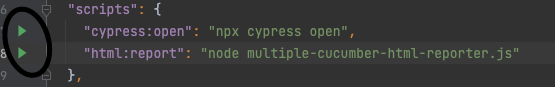
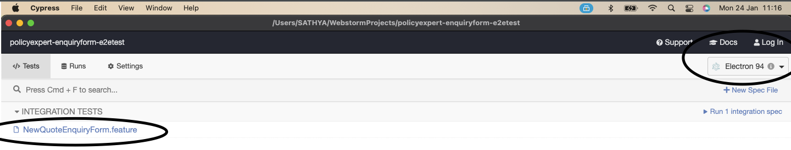
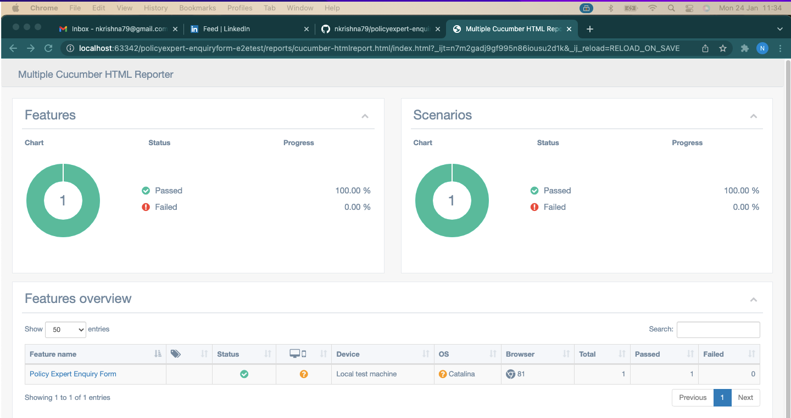

# policyexpert-enquiryform-e2etest

## Project intro

This project is written using Javascript and uses Cypress as the E2E test automation tool. For writing features and
scenarios in BDD, this project has been integrated with cypress cucumber preprocessor.

## Pre-requisites

1. Node version >12

2. Windows Or Mac desktop with a basic browser

3. IDE of your choice - preferrably webstorm. I have used webstorm because its easy to find the glude code between the
   feature file and step definitions

4. NPM version >6

## Project structure

### Feature files

Feature files are located in the main cypress directory /cypress/integration. An example feature file

````
@getquotes
Feature: Policy Expert Enquiry Form
I would like to get some quotes from policy expert
so that I can make an informed decision

Scenario Outline: Get Quotes
Given I access policyexperts enquiry form
When I submit the details section to get a quote for "<TypeOfHomeInsurancedneeded>"
Then I should be taken to quotes section

    Examples:
      | TypeOfHomeInsurancedneeded |
      | Buildings only             |
````

### Step definitions

Step definition files are located in cypress/support/step_definitions. Here you can view the implementation of the form
filling steps right from start to the end. Most of the low level has been abstracted into a separate class with some
basic functions

### Function class

You can find the low level function class in cypress/support/enquiryformhelper.js. Functions are used in this project to
define a repititive action that is used across the form filling process. So for example, entering text in a text field
in the form we can use

```javascript
static enterTextInField(index)
{
    return cy.get('[data-testid="question"]').eq(index);
}
````
And when filling in the form we re-use the above function as like below : 
```javascript
this.enterTextInField(1).type(firstname);
this.enterTextInField(2).type(lastname);
```

### Random data generator

For filling in the form with random data, this project uses chance.js library. Please refer to the document for various
data that can be generated using this library.

### Execution

When running test, there are 2 ways you can run the test

### option:1

using the npm script inside package.json. Just run it using

This will open cypress test runner and you will be able to see the feature file. Choose your browser and click on the
.feature to run the test.


### option:2

you can use a terminal and you can run the test by specifying the following command directly

```javascript
npx
cypress - tags
run--
headed--
browser
chrome - e
TAGS = @getquotes
```

### Reporter

### multiple-cucumber-html-reporter

This project is also integrated with the multiple-cucumber-html-reporter. To generate the reports, please run the following command after the execution of the test

```javascript
node node multiple-cucumber-html-reporter.js
```
Or you can run the html:report script from package.json



### References

For
multiple-cucumber-html-report: https://kailash-pathak.medium.com/generate-cucumber-html-report-in-cypress-3691d596ef19

For Cypress : https://docs.cypress.io/

For random data generator: https://chancejs.com/

For cypress-cucumber-preprocessor: https://github.com/TheBrainFamily/cypress-cucumber-preprocessor
